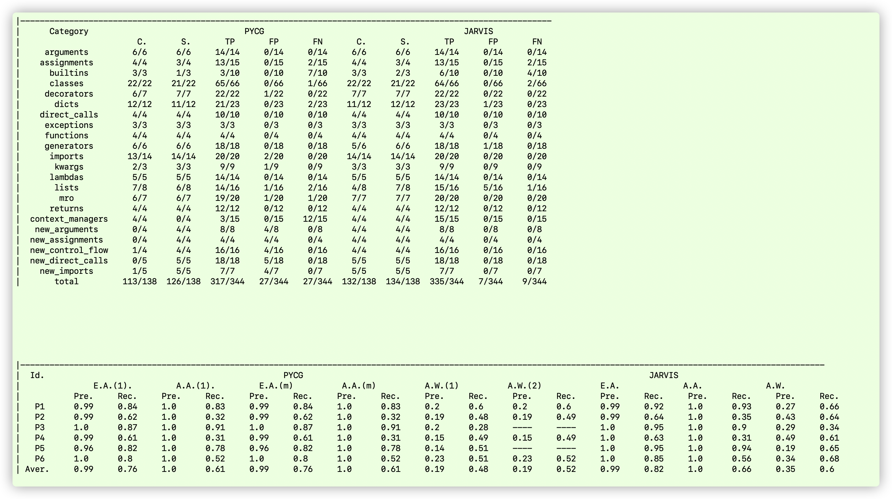

## Dataset and Ground truth

The micro-benchmark and macro-benchmark is provide in `dataset` and `ground_truth` directory.

## Getting Jarvis to run

Prerequisites:

* Python = 3.8
* PyCG: tool/PyCG
* Jarvis: tool/Jarvis

run `jarvis_cli.py`.

Jarvis usage:

```bash
$ python3 tool/Jarvis/jarvis_cli.py [module_path1 module_path2 module_path3...] [--package] [--decy] [-o output_path]
```

Jarvis help:

```bash
$ python3 tool/Jarvis/jarvis_cli.py -h
  usage: jarvis_cli.py [-h] [--package PACKAGE] [--decy] [--precision]
                       [--moduleEntry [MODULEENTRY ...]]
                       [--operation {call-graph,key-error}] [-o OUTPUT]
                       [module ...]

  positional arguments:
    module                modules to be processed, which are also 'Demands' in D.W. mode 

  options:
    -h, --help            show this help message and exit
    --package PACKAGE     Package containing the code to be analyzed
    --decy                whether analyze the dependencies
    --precision           whether flow-sensitive
    --entry-point [MODULEENTRY ...]
                          Entry functions to be processed
    -o OUTPUT, --output OUTPUT
                          Output call graph path
```

*Example 1:* analyze bpytop.py in E.A. mode.

```bash
$ python3 tool/Jarvis/jarvis_cli.py dataset/macro_benchmark/pj/bpytop/bpytop.py --package dataset/macro_benchmark/pj/bpytop -o jarvis.json
```

*Example 2:* analyze bpytop.py in D.W. mode. Note we should prepare all the dependencies in the virtual environment.

```bash
# create virtualenv environment
$ virtualenv venv python=python3.8
# install Dependencies in virtualenv environment
$ python3 -m pip install psutil
# run jarvis
$ python3 tool/Jarvis/jarvis_cli.py dataset/macro_benchmark/pj/bpytop/bpytop.py --package dataset/macro_benchmark/pj/bpytop --decy -o jarvis.json
```


## Evaluation 

### RQ1 and RQ2 Setup

cd to the root directory of the unzipped files.

```bash
# 1. run micro_benchmark
$ ./reproducing_RQ12_setup/micro_benchmark/test_All.sh
# 2. run macro_benchmark
$ ./reproducing_RQ12_setup/macro_benchmark/pycg_EA.sh
#     PyCG iterates once
$ ./reproducing_RQ12_setup/macro_benchmark/pycg_EW.sh 1
#     PyCG iterates twice
$ ./reproducing_RQ12_setup/macro_benchmark/pycg_EW.sh 2
#     PyCG iterates to convergence 
$ ./reproducing_RQ12_setup/macro_benchmark/pycg_EW.sh
$ ./reproducing_RQ12_setup/macro_benchmark/jarvis_DA.sh
$ ./reproducing_RQ12_setup/macro_benchmark/jarvis_EA.sh
$ ./reproducing_RQ12_setup/macro_benchmark/jarvis_DW.sh
```

### RQ1. Scalability Evaluation


#### Scalability results

Run

```bash
$ python3 ./reproducing_RQ1/gen_table.py
```

The results are shown below:


#### AGs and FAGs 

Run 

```shell
$ pip3 install matplotlib
$ pip3 install numpy
$ python3 ./reproducing_RQ1/FAG/plot.py
```

The generated graphs are `pycg-ag.pdf`, `pycg-change-ag.pdf` and `jarvis-fag.pdf`, where they represents Fig. 9a, Fig. 9b and Fig 10, correspondingly.


### RQ2. Accuracy Evaluation

#### Accuracy results

Run

```bash
$ python3 ./reproducing_RQ2/gen_table.py     
```

The generated results:

