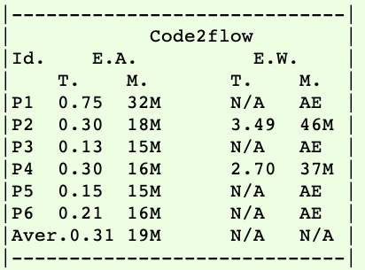
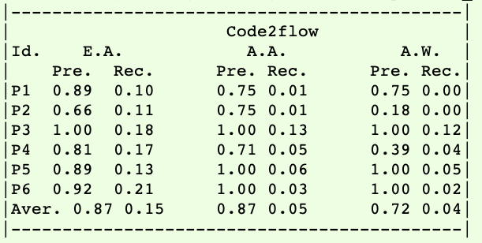

<head>
  	<script type="text/javascript" src="https://cdnjs.cloudflare.com/ajax/libs/mathjax/2.7.1/MathJax.js?config=TeX-AMS-MML_HTMLorMML"></script>
    <script type="text/x-mathjax-config">
        MathJax.Hub.Config({
            tex2jax: {
            skipTags: ['script', 'noscript', 'style', 'textarea', 'pre'],
            inlineMath: [['$','$']]
            }
        });
    </script>
</head>


## ABSTRACT

Call graph construction is the foundation of inter-procedural static analysis. PyCG is the state-of-the-art approach for constructing call graphs for Python programs. Unfortunately, PyCG does not scale to large programs when adapted to whole-program analysis where application and dependent libraries are both analyzed. Moreover, PyCG is flow-insensitive and does not fully support Python’s features, hindering its accuracy.

To overcome these drawbacks, we propose a scalable and precise approach for constructing application-centered call graphs for Python programs, and implement it as a prototype tool JARVIS. JARVIS maintains a type graph (i.e., type relations of program identifiers) for each function in a program to allow type inference. Taking one function as an input, JARVIS generates the call graph on-the-fly, where flow-sensitive intra-procedural analysis and inter-procedural analysis are conducted in turn and strong updates are conducted. Our evaluation on a micro-benchmark of 135 small Python programs and a macro-benchmark of 6 real- world Python applications has demonstrated that JARVIS can significantly improve PYCG by at least 67% faster in time, 84% higher in precision, and at least 20% higher in recall.


The paper has been submitted to ICSE 2025. The Jarvis artifact is provided [here](Jarvis.zip).

## Transfer rules

$$\begin{align*}
&{Import:}~from~m~^\prime~import~x, import~m^\prime \\
&\frac{\begin{matrix}
t_1=new\_type(m,~x), t_2=new\_type(m^\prime,~x), t_3=t_m, t_4=new\_type(m^\prime)
\end{matrix}
}{ \Delta_{e} \leftarrow \langle t_1, t_2, e\rangle, \Delta_{e} \leftarrow \langle t_3, t_4, e\rangle}\\
&{Assign:}~x=y \\
&\frac{t_1=new\_type(x), t_2=new\_type(y)} { \Delta_{e} \leftarrow \langle t_1, t_2, e\rangle} \\
&{Store:}~x.field~=~y\\
&\frac{t_i \in points(x), t_2 = new\_type(y)}{\Delta_{e} \leftarrow \langle t_i.field, t_2, e\rangle}\\
&{Load:}~y~=~x.field\\
&\frac{t_1 \in new\_type(y), t_j \in points(x)}{\Delta_{e} \leftarrow \langle t_1, t_j.field,~e \rangle} \\
&{New:}~y~=~x(...) \\
&\frac{t_1=new\_type(y), t_2=new\_type(x)}{
\begin{matrix}
\Delta_{e}~\leftarrow~{inter\_analysis}(f,~e,FTG^f_{e.p}), \Delta_{e}~\leftarrow~\langle~t_1,~t_2,~e~\rangle\\
\end{matrix}
} \\
&{Call:}~a=x.m(...) \\
&\frac{
\begin{matrix}
t_1=new\_type(x), t_2=new\_type(t_1.m), t_3=new\_type(a)
\end{matrix}
}
{\begin{matrix}
\Delta_{call}~\leftarrow~{inter\_analysis}(f,~e,FTG^f_{e.p}), \Delta_{call}~\leftarrow~\langle~t_3,~t_2.\textit{ret},~e\rangle
\end{matrix}
}\\
&{Func:}~def~m^\prime(args...) ...\\
&\frac{d=new\_type(m^\prime),t_{1...n}=new\_type(args_{1...n})}{\Delta_{e} \leftarrow \langle d, \varnothing, e \rangle,F \leftarrow \langle d,args_{1...n} \rangle}\\
&{Class:}~class~cls(base...) ...\\
&\frac{d=new\_type(cls),base_{1...n}=new\_type(base_{1...n})}{\Delta_{e} \leftarrow \langle d, \varnothing, e \rangle,C \leftarrow \langle d,base_{1...n} \rangle}\\
&{Return:}~def~m^\prime ...~return~x\\
&\frac{t_1=new\_type(m^\prime), t_2=new\_type(x)}{\Delta_{e} \leftarrow \langle t_1.\textit{ret}, t_2, e \rangle}\\
&{With:}~with~cls()~as~f\\
&\frac{
\begin{matrix}
t_1=new\_type(cls), t_2=new\_type(cls.\_\_enter\_\_), t_3=new\_type(f)
\end{matrix}
}
{\begin{matrix}
\Delta_{call}~\leftarrow~{inter\_analysis}(f,~e,FTG^f_{e.p}), \Delta_{call}~\leftarrow~\langle~t_3,~t_2.\textit{ret},~e\rangle
\end{matrix}
}\\
&{For:}~for~x~in~cls()\\
&\frac{
\begin{matrix}
t_1=new\_type(cls), t_2=new\_type(cls.\_\_iter\_\_), t_3=new\_type(f)
\end{matrix}
}
{\begin{matrix}
\Delta_{call}~\leftarrow~{inter\_analysis}(f,~e,FTG^f_{e.p}), \Delta_{call}~\leftarrow~\langle~t_3,~t_2.\textit{ret},~e\rangle
\end{matrix}
}\\
&{If:}~if ...\\
&
\frac{}{\begin{matrix}
 CFG \leftarrow \langle {Expr}, {Ctrl}, {if}, {\varnothing}\rangle
\end{matrix}}
\\
&{If-Else:}~if ...~else~ ...\\
&
\frac{}{\begin{matrix}
 CFG \leftarrow \langle {Expr}, {Ctrl}, {<if,else>}, {\varnothing}\rangle
\end{matrix}}
\\
&{Elif:}~elif~...\\
&
\frac{}{\begin{matrix}
 CFG \leftarrow \langle {Expr}, {Ctrl}, {else}, {\varnothing}\rangle,  \langle {Expr}, {Ctrl}, {if}, {\varnothing}\rangle
\end{matrix}}
\\
&{While:}~while ...\\
&
\frac{}{\begin{matrix}
 CFG \leftarrow \langle {Expr}, {Ctrl}, {while}, {\varnothing}\rangle
\end{matrix}}
\\
&{While-Else:}~while ...~else~ ...\\
&
\frac{}{\begin{matrix}
 CFG \leftarrow \langle {Expr}, {Ctrl}, {<while,else>}, {\varnothing}\rangle
\end{matrix}}
\\
&{Exception:}~try ...~catch~ ...\\
&\frac{}{\begin{matrix}
 CFG \leftarrow \langle {Expr}, {Ctrl}, {<try,catch>}, {\varnothing}\rangle
\end{matrix}}
\\
\end{align*}$$


## Dataset and Ground truth

The micro-benchmark and macro-benchmark are provided in `dataset` and `grount_truth` directory.

## Getting Jarvis to run

Prerequisites:
* Python = 3.8
* PyCG: tool/PyCG
* Jarvis: tool/Jarvis

run `jarvis_cli.py`.

Jarvis usage:

```bash
$ python3 tool/Jarvis/jarvis_cli.py [module_path1 module_path2 module_path3...] [--package] [--decy] [-o output_path]
```

Jarvis help:

```bash
$ python3 tool/Jarvis/jarvis_cli.py -h
  usage: jarvis_cli.py [-h] [--package PACKAGE] [--decy] [--precision]
                       [--moduleEntry [MODULEENTRY ...]]
                       [--operation {call-graph,key-error}] [-o OUTPUT]
                       [module ...]

  positional arguments:
    module                modules to be processed, which are also application entries in A.W. mode 

  options:
    -h, --help            show this help message and exit
    --package PACKAGE     Package containing the code to be analyzed
    --decy                whether analyze the dependencies
    --precision           whether flow-sensitive
    --entry-point [MODULEENTRY ...]
                          Entry functions to be processed
    -o OUTPUT, --output OUTPUT
                          Output call graph path
```

*Example 1:* analyze bpytop.py in E.A. mode.

```bash
$ python3 tool/Jarvis/jarvis_cli.py dataset/macro_benchmark/pj/bpytop/bpytop.py --package dataset/macro_benchmark/pj/bpytop -o jarvis.json
```

*Example 2:* analyze bpytop.py in A.W. mode. Note we should prepare all the dependencies in the virtual environment.

```bash
# create virtualenv environment
$ virtualenv venv python=python3.8
# install Dependencies in virtualenv environment
$ python3 -m pip install psutil
# run jarvis
$ python3 tool/Jarvis/jarvis_cli.py dataset/macro_benchmark/pj/bpytop/bpytop.py --package dataset/macro_benchmark/pj/bpytop --decy -o jarvis.json
```


## Evaluation 

### RQ1 and RQ2 Setup

cd to the root directory of the unzipped files.

```bash
# 1. run micro_benchmark
$ ./reproducing_RQ12_setup/micro_benchmark/test_All.sh
# 2. run macro_benchmark
$ ./reproducing_RQ12_setup/macro_benchmark/pycg_EA.sh
#     PyCG iterates once
$ ./reproducing_RQ12_setup/macro_benchmark/pycg_EW.sh 1
#     PyCG iterates twice
$ ./reproducing_RQ12_setup/macro_benchmark/pycg_EW.sh 2
#     PyCG iterates to convergence 
$ ./reproducing_RQ12_setup/macro_benchmark/pycg_EW.sh
$ ./reproducing_RQ12_setup/macro_benchmark/jarvis_AA.sh
$ ./reproducing_RQ12_setup/macro_benchmark/jarvis_EA.sh
$ ./reproducing_RQ12_setup/macro_benchmark/jarvis_AW.sh
```

### RQ1. Scalability Evaluation


#### Scalability results
Run

```bash
$ python3 ./reproducing_RQ1/gen_table.py
```

The results are shown below:


#### AGs and FTGs 

Run 

```shell
$ pip3 install matplotlib
$ pip3 install numpy
$ python3 ./reproducing_RQ1/FTG/plot.py
```

The generated graphs are `pycg-ag.pdf`, `pycg-change-ag.pdf` and `jarvis-ftg.pdf`, where they represents Fig. 9a, Fig. 9b and Fig 10, correspondingly.


### RQ2. Accuracy Evaluation

#### Accuracy results

Run

```bash
$ python3 ./reproducing_RQ2/gen_table.py     
```

The generated results:


### Comparing to Code2Flow

Scalability results (RQ1), AE denotes AssertionError:



Accuracy results (RQ2):



### Case Study: Fine-grained Tracking of Vulnerable Dependencies

The 43 python projects out of the top 200 Highly-starred projects are listed in [file](Jarvis/reproducing_RQ12_setup/projects_case_study.txt)

#### 1. Target projects

[Fastapi](https://github.com/tiangolo/fastapi),  [Httpie](https://github.com/httpie/httpie), [Scrapy](https://github.com/scrapy/scrapy), [Lightning](github.com/Lightning-AI/lightning), [Airflow](https://github.com/apache/airflow),[sherlock](https://github.com/sherlock-project/sherlock),[wagtail](https://github.com/wagtail/wagtail)

#### 2. Vulnerable libraries in Top 10 dependencies

* ~~**Html**: CVE-2018-17142~~ (Golang)
* **cryptography**: [CVE-2016-9243](https://github.com/pyca/cryptography/commit/b924696b2e8731f39696584d12cceeb3aeb2d874), [CVE-2020-36242](https://github.com/pyca/cryptography/compare/3.3.1...3.3.2), [CVE-2018-10903](https://github.com/pyca/cryptography/pull/4342/commits/688e0f673bfbf43fa898994326c6877f00ab19ef)
* **urllib3**: [CVE-2021-33503](https://github.com/urllib3/urllib3/commit/2d4a3fee6de2fa45eb82169361918f759269b4ec), [CVE-2019-11324](https://github.com/urllib3/urllib3/compare/a6ec68a...1efadf4), [CVE-2019-11236](https://github.com/urllib3/urllib3/issues/1553), [CVE-2020-7212](https://github.com/urllib3/urllib3/commit/a74c9cfbaed9f811e7563cfc3dce894928e0221a)
* **requests**: [CVE-2014-1830](https://bugs.debian.org/cgi-bin/bugreport.cgi?bug=733108), [CVE-2015-2296](https://github.com/kennethreitz/requests/commit/3bd8afbff29e50b38f889b2f688785a669b9aafc), [CVE-2018-18074](https://github.com/psf/requests/commit/c45d7c49ea75133e52ab22a8e9e13173938e36ff)
* ~~**psutil**: CVE-2019-18874~~ (C)
* ~~**Numpy**: CVE-2021-33430, CVE-2014-1858, CVE-2014-1859, CVE-2017-12852~~ (cpp)
* ~~**lxml**: CVE-2021-28957, CVE-2018-19787, CVE-2020-27783, CVE-2014-3146~~ (js)
* **jinja2** : [CVE-2020-28493](https://github.com/pallets/jinja/pull/1343/commits/ef658dc3b6389b091d608e710a810ce8b87995b3), [CVE-2014-0012](https://github.com/mitsuhiko/jinja2/commit/acb672b6a179567632e032f547582f30fa2f4aa7), [CVE-2014-1402](http://advisories.mageia.org/MGASA-2014-0028.html)
* **sqlalchemy** : [CVE-2019-7164](https://github.com/sqlalchemy/sqlalchemy/issues/4481), [CVE-2019-7548](https://github.com/sqlalchemy/sqlalchemy/issues/4481#issuecomment-461204518)
* **httpx**: [CVE-2021-41945](https://github.com/encode/httpx/pull/2214)

The CVEs of html , numpy , lxml,psutil don't relate to  Python , we don't care them.

#### 3. Vulnerable projects using dependency analysis


##### sherlock

```
- sherlock.sherlock
  - requests(v2.28.0)
    - urllib3(v1.26.0) ---- [CVE-2021-33503,CVE-2019-11324,CVE-2019-11236,CVE-2020-7212]
- sherlock.sites
  - requests(v.2.28.0)
    - urllib3(v1.26.0) ---- [CVE-2021-33503,CVE-2019-11324,CVE-2019-11236,CVE-2020-7212]
```

##### airflow

```
- airflow.kubernetes.kube_client
  - urllib3(v1.26.0) ---- [CVE-2021-33503,CVE-2019-11324,CVE-2019-11236,CVE-2020-7212]
- airflow.providers.cncf.kubernetes.operators.pod
  - urllib3(v1.26.0) ---- [CVE-2021-33503,CVE-2019-11324,CVE-2019-11236,CVE-2020-7212]
- airflow.providers.cncf.kubernetes.utils.pot_manager
  - urllib3(v1.26.0) ---- [CVE-2021-33503,CVE-2019-11324,CVE-2019-11236,CVE-2020-7212]
- airflow.executors.kubernetes_executor
  - urllib3(v1.26.0) ---- [CVE-2021-33503,CVE-2019-11324,CVE-2019-11236,CVE-2020-7212]
......
```

##### wagtail

```
- wagtail.contrib.frontent_cache.backends
  - requests(v2.28.0)
    - urllib3(v1.26.0) ---- [CVE-2021-33503,CVE-2019-11324,CVE-2019-11236,CVE-2020-7212]
```

##### Httpie

```
- httpie.client
  - urllib3(v1.26.0) ---- [CVE-2021-33503,CVE-2019-11324,CVE-2019-11236,CVE-2020-7212]
- httpie.ssl_
  - urllib3(v1.26.0) ---- [CVE-2021-33503,CVE-2019-11324,CVE-2019-11236,CVE-2020-7212]
- httpie.models
  - urllib3(1.26.0) ---- [CVE-2021-33503,CVE-2019-11324,CVE-2019-11236,CVE-2020-7212]
```

##### Scrapy

```
- scrapy.downloadermiddlewares.cookies
  - tldextract(v3.4.4)
    - requests(v2.28.0)
      - urllib3(v1.26.0) ---- [CVE-2021-33503,CVE-2019-11324,CVE-2019-11236,CVE-2020-7212]
```

##### Lightning

```
- lightning.app.utilities.network
  - requests(v2.28.0)
    - urllib3(v1.26.0) ---- [CVE-2021-33503,CVE-2019-11324,CVE-2019-11236,CVE-2020-7212]
- lightning.app.utilities.network
  - requests(v2.28.0)
    - urllib3(v1.26.0) ---- [CVE-2021-33503,CVE-2019-11324,CVE-2019-11236,CVE-2020-7212]
- lightning.app.utilities.network
  - requests(v2.28.0)
    - urllib3(v1.26.0) ---- [CVE-2021-33503,CVE-2019-11324,CVE-2019-11236,CVE-2020-7212]
...
```

#### 4. Vulnerable projects using method-level invocation analysis

##### Fastapi

According to the [patch commit](https://github.com/urllib3/urllib3/commit/2d4a3fee6de2fa45eb82169361918f759269b4ec), the vulnerable method of CVE-2021-33503 in urllib3 is `urllib3.util.url`.

Below is the method-level invocation path:

##### Httpie

```
- httpie.apapters.<main>
  - requests.adapters.<main>
    - urllib3.contrib.socks.<main>
      - Urllib3.util.url.<main> ---- CVE-2021-33503
```

##### Scrapy
```
- scrapy.downloadermiddlewares.cookies.<main>
  - tldextract.__init__.<main>
    - tldextract.tldextract.<main>
      - tldextract.suffix_list.<main>
        - requests_file.<main>
          - requests.adapters.<main>
            - Urllib3.util.url.<main> ---- CVE-2021-33503
```
##### Lighting
```
- lightning.app.utilities.network.<main>
  - requests.adapters.<main>
    - urllib3.contrib.socks.<main>
      - Urllib3.util.url.<main> ---- CVE-2021-33503
```
##### Airflow
```
- airflow.providers.amazon.aws.hooks.base_aws.BaseSessionFactory._get_idp_response
  - requests.adapters.<main>
    - urllib3.contrib.sock.<main>
      - urllib3.util.url.<main> ---- CVE-2021-33503
```

**PS:** <main>  represents body code block of python file.(Because python doesn't need entry function)

### Acknowledgements


Our artifact has reused part of the functionalities from third party libraries. i.e., [PyCG](https://github.com/vitsalis/PyCG).

Vitalis Salis et al. PyCG: Practical Call Graph Generation in Python. In 43rd International Conference on Software Engineering (ICSE), 25–28 May 2021.

